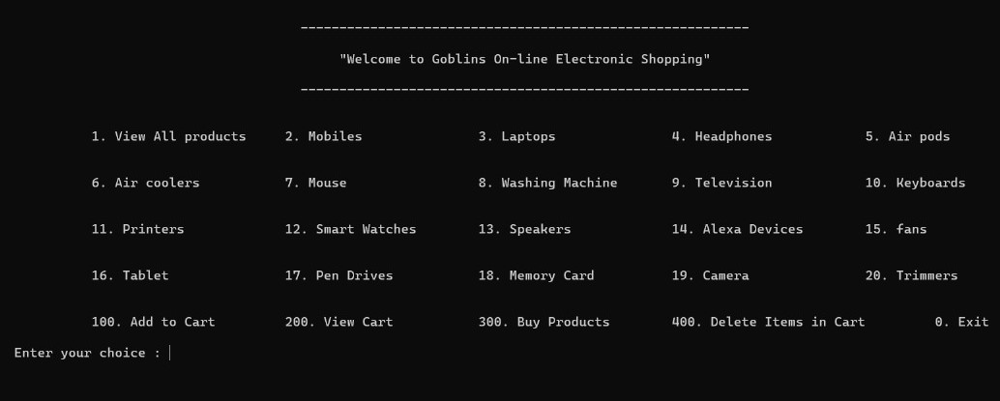
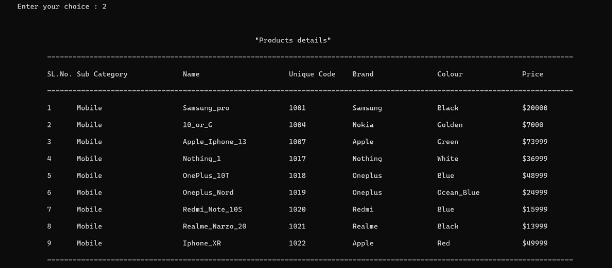
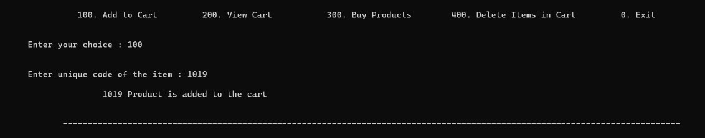
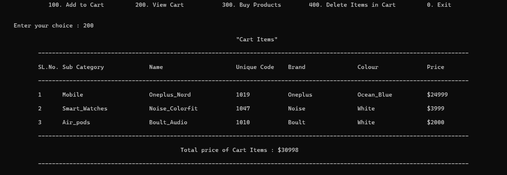
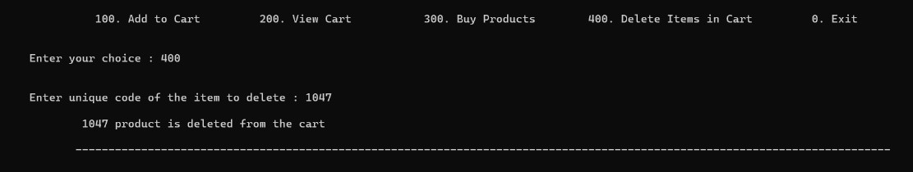
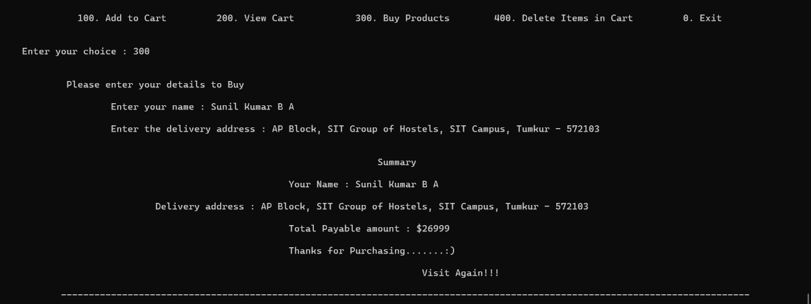

# 🚀 Welcome to Goblin's Online Electronic Shopping

## 🛠️ Installation


```bash
## Installation

# To install Goblins Online Electronic Shopping application, simply clone the repository and compile the main.cpp file using a C++ compiler.

 https://github.com/SunilKumarba2955/Online-Electronic-Shopping
  $ git clone https://github.com/SunilKumarba2955/Online-Electronic-Shopping.git
  $ g++ main.cpp -o online-pay
```

## 🌐 Project Overview
<p>This project is an Online Electronics Shopping application built entirely using C++. It was developed as part of an academic learning experience, focusing on object-oriented programming (OOP) concepts. The application allows users to explore a variety of electronic goods such as Mobiles, Laptops, Air Pods, Air Coolers, Pen Drives, and Smart Watches. The primary goal is to provide a seamless and user-friendly experience for electronic shopping</p>

## 🚀 Getting Started
When you run the program, you will be greeted with the heading as <b>"Welcome to Goblin's Online Electronic Shopping"</b>.

Below this, you will find a menu displaying the types of items available:


## 🌈 Exploring Products
To view the products of a specific type, enter the corresponding integer from the menu. For example, entering 2 will display all available mobiles with details such as product name, type, unique code, price, color, and brand. Which showing below in figure.



## 🛒 Adding Items to Cart
If you wish to add a product to your cart, use the 100 option and enter the unique code of the desired item when prompted.



## 🛍️ Viewing Cart
To view the items in your cart, enter 200. This will display a list of products currently in your cart.



## 🗑️ Deleting Items from Cart
To remove an item from your cart, enter 400 and provide the unique code of the product you want to delete.



## 💳 Checkout Process
When you are ready to make a purchase, enter 300. The system will prompt you to enter your name and address for product delivery.


(You may wonder, does the user need not to pay anything? Well, yes, currently we are providing Cash on Delivery option only... Just kidding! 😄)

## 🤝 Contributing

If you want to contribute to this project, please follow these guidelines:

- Fork the project.
- Create a new branch for your changes.
- Make your changes and test them.
- Submit a pull request with a description of your changes.

## 📬 Contact
Questions or feedback? Reach out at sunilkumarba.1si20cs116@gmail.com. Let the Goblin Shopping adventure begin! 🌟

<code>Feel free to modify any part of it as needed!</code>